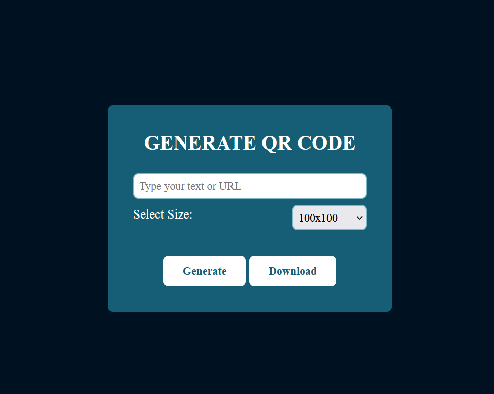

QR Code Generator

This is a simple QR code generator built using JavaScript. It allows users to generate a QR code based on the input text or URL.
Features

    Generate a QR code for any text or URL.
    Simple and clean UI.
    Download the QR code as an image.

## Screenshot

